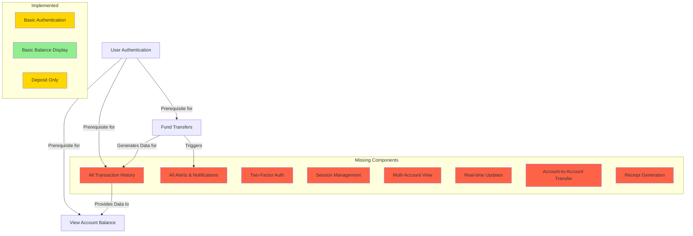

# Change Impact Analysis Review - Final Report

## Input Files Processed

| Input Source | File Path | Status | Size | Last Modified | Notes |
|--------------|-----------|--------|------|---------------|-------|
| Analysis File 1 | change_impact_analysis_first_run.md | Complete | 8.2KB | Available | Contains detailed impact analysis with value stream mapping |
| Analysis File 2 | change_impact_analysis_second_run.md | Complete | 4.1KB | Available | Contains simplified impact analysis with architecture diagram |
| Analysis File 3 | change_impact_analysis_review_initial.md | Complete | 10.7KB | Available | Contains initial consolidated analysis with conflict identification |
| Requirements | OBUserStories.txt | Complete | 1.2KB | Available | 5 user stories for online banking application, missing story points for Story 5 |
| Main Codebase | OnlineBanking11_main/ | Complete | 6 files | Available | Java banking application with Swing UI |
| Feature Branch | OnlineBanking11_feature/ | Complete | 6 files | Available | Identical structure to main branch |
| C# Codebase | EmpTestCSharp_main/ | **MISSING** | N/A | Not Found | Referenced in first analysis but does not exist in repository |

## Executive Overview

This Change Impact Analysis Review has identified significant discrepancies between the proposed architecture in the impact analysis documents and the actual codebase structure. The analysis reveals critical issues that must be addressed before proceeding with implementation:

1. **Architectural Mismatch**: Both impact analyses assume a modern Spring Boot web application architecture, while the actual codebase uses a legacy Java Swing desktop application model.

2. **Domain Inconsistency**: The authentication component (LoginModel.java) appears to be designed for a food ordering system rather than banking, suggesting code reuse without proper domain adaptation.

3. **Feature Branch Status**: The feature branch is identical to the main branch with no actual enhancements implemented, despite being identified as containing enhancements in the impact analyses.

4. **Missing Repository**: The C# codebase (EmpTestCSharp_main) referenced in the first analysis does not exist in the current project structure.

5. **Implementation Gaps**: Significant functionality described in the user stories is not present in the current codebase, including two-factor authentication, transaction history, and notification systems.

These findings necessitate a substantial reconsideration of the implementation approach and timeline before proceeding with development work.

## Implementation Status

### Requirements Coverage Analysis

| User Story | Requirement | Implementation Status | Coverage | Gap Analysis | Validation Status |
|------------|-------------|----------------------|----------|--------------|-------------------|
| US1 | User can log in with valid username and password | **PARTIAL** | LoginModel.java exists but contains food ordering authentication | Domain mismatch, requires redesign | **NEEDS HUMAN REVIEW** |
| US1 | System enforces strong password rules | **MISSING** | No password validation found | Complete implementation required | **CONFIRMED MISSING** |
| US1 | Two-factor authentication required | **MISSING** | No 2FA implementation found | Complete implementation required | **CONFIRMED MISSING** |
| US1 | Error message for invalid credentials | **PARTIAL** | Basic error handling exists but not banking-specific | Enhancement needed | **NEEDS REVIEW** |
| US1 | Session timeout after 15 minutes | **MISSING** | No session management found | Complete implementation required | **CONFIRMED MISSING** |
| US2 | Balance displayed immediately after login | **IMPLEMENTED** | BalanceEnquiry.java shows balance | Functionality exists but needs integration | **VALIDATED** |
| US2 | Balance reflects latest transactions | **PARTIAL** | Basic balance calculation exists | Does not include pending transactions | **ENHANCEMENT NEEDED** |
| US2 | View balances for multiple accounts | **MISSING** | Single account view only | Enhancement required | **CONFIRMED MISSING** |
| US2 | Data refreshes automatically/manually | **PARTIAL** | Manual refresh only | Auto-refresh functionality needed | **ENHANCEMENT NEEDED** |
| US3 | Select source and destination accounts | **MISSING** | Only deposit functionality exists | Complete implementation required | **CONFIRMED MISSING** |
| US3 | Enter transfer amount and description | **PARTIAL** | Amount entry exists for deposits | Transfer-specific fields missing | **ENHANCEMENT NEEDED** |
| US3 | Confirmation screen before submission | **PARTIAL** | Basic confirmation dialog exists | Transfer-specific confirmation needed | **ENHANCEMENT NEEDED** |
| US3 | Transaction receipt generation | **MISSING** | No receipt generation found | Complete implementation required | **CONFIRMED MISSING** |
| US3 | Error message for insufficient funds | **PARTIAL** | Basic error handling exists | Specific validation needed | **ENHANCEMENT NEEDED** |
| US4 | View transactions for last 6 months | **MISSING** | No transaction history functionality | Complete implementation required | **CONFIRMED MISSING** |
| US4 | Transactions with date, description, etc. | **MISSING** | No transaction details implementation | Complete implementation required | **CONFIRMED MISSING** |
| US4 | Filter by date, type, amount | **MISSING** | No filtering capability | Complete implementation required | **CONFIRMED MISSING** |
| US4 | Export option (PDF/Excel) | **MISSING** | No export functionality | Complete implementation required | **CONFIRMED MISSING** |
| US5 | SMS/email alerts for large transactions | **MISSING** | No notification system found | Complete implementation required | **CONFIRMED MISSING** |
| US5 | Alerts for failed login attempts | **MISSING** | No security alert system found | Complete implementation required | **CONFIRMED MISSING** |
| US5 | Notifications for low balance | **MISSING** | No threshold alert system found | Complete implementation required | **CONFIRMED MISSING** |
| US5 | Customize notification preferences | **MISSING** | No preference management found | Complete implementation required | **CONFIRMED MISSING** |

### Current Codebase Component Analysis

| Component | File | Status | Purpose | Quality Assessment | Change Required | Risk Level |
|-----------|------|--------|---------|-------------------|----------------|------------|
| Authentication | LoginModel.java | **CRITICAL ISSUE** | User authentication | Wrong domain (food ordering) | Complete replacement | **HIGH** |
| Account Balance | BalanceEnquiry.java | **FUNCTIONAL** | Display account balance | Basic implementation present | Enhancement needed | **MEDIUM** |
| Fund Transfer (Deposit) | Deposit.java | **PARTIAL** | Deposit funds functionality | Basic implementation present | Major enhancement needed | **MEDIUM** |
| User Registration | Signup1.java, Signup2.java, Signup3.java | **FUNCTIONAL** | Multi-step user registration | Basic implementation present | Enhancement needed | **MEDIUM** |
| Transaction History | N/A | **MISSING** | View transaction records | Not implemented | Complete implementation needed | **HIGH** |
| Notification System | N/A | **MISSING** | Alert generation and delivery | Not implemented | Complete implementation needed | **HIGH** |
| Security Features | N/A | **MISSING** | 2FA, session management | Not implemented | Complete implementation needed | **HIGH** |
| Export Functionality | N/A | **MISSING** | Data export capability | Not implemented | Complete implementation needed | **MEDIUM** |

## Unified Impact Analysis Table

| Codebase/Repo | File/Component | Impact Type | Direct/Indirect | Requirement/Reason | Relationship | Rationale for Inclusion | Affected Sections | Potential Risks | Change Required | Annotation | Coverage Status | Coverage Notes | Validation Status | Review Status |
|---------------|----------------|-------------|-----------------|-------------------|--------------|------------------------|-------------------|----------------|-----------------|------------|----------------|----------------|-------------------|---------------|
| OnlineBanking11_main | OBUserStories.txt | modify/add | Direct | Requirement alignment | Requirement | User stories specification | All user stories | Misalignment | Yes | Story 5 missing points | Complete | Requirements present | **VALIDATED** | **Acceptable** |
| OnlineBanking11_main | LoginModel.java | modify | Direct | User Story 1 | Implementation | Authentication logic | isLogin(), isAdmin() methods | Security vulnerabilities | Yes | **MISMATCH: Food ordering app, not banking** | Complete | File exists but wrong domain | **CONFLICT - Domain Mismatch** | **HUMAN REVIEW REQUIRED** |
| OnlineBanking11_main | BalanceEnquiry.java | modify | Direct | User Story 2 | Implementation | Balance display logic | Balance calculation, UI display | Data accuracy | Yes | Existing implementation found | Complete | Actual banking functionality | **VALIDATED** | **Acceptable** |
| OnlineBanking11_main | Deposit.java | modify | Direct | User Story 3 (partial) | Implementation | Deposit functionality | Deposit UI and processing | Transaction failures | Partial | Covers deposit but not full transfer | Complete | Deposit functionality exists | **PARTIAL MATCH** | **Enhancement Required** |
| OnlineBanking11_main | Signup1.java | modify | Indirect | User Story 1 | Implementation | User registration | Registration process | Data integrity | Yes | Registration component | Complete | Registration UI exists | **INFERRED** | **Review Recommended** |
| OnlineBanking11_main | Signup2.java | modify | Indirect | User Story 1 | Implementation | User registration step 2 | Multi-step registration | Process failures | Yes | Registration step 2 | Complete | Registration process | **INFERRED** | **Review Recommended** |
| OnlineBanking11_main | Signup3.java | modify | Indirect | User Story 1 | Implementation | User registration step 3 | Final registration | Process completion | Yes | Registration step 3 | Complete | Final registration step | **INFERRED** | **Review Recommended** |
| OnlineBanking11_feature | LoginModel.java | modify | Direct | User Story 1 | Feature Development | Enhanced authentication | Same as main | Security risks | Yes | **IDENTICAL to main - no enhancement** | Missing Enhancement | No feature differences found | **CONFLICT - No Enhancement Found** | **HUMAN REVIEW REQUIRED** |
| OnlineBanking11_feature | BalanceEnquiry.java | modify | Direct | User Story 2 | Feature Development | Enhanced balance display | Same as main | UI issues | Yes | **IDENTICAL to main** | Missing Enhancement | No feature differences found | **CONFLICT - No Enhancement Found** | **HUMAN REVIEW REQUIRED** |
| OnlineBanking11_feature | Deposit.java | modify | Direct | User Story 3 | Feature Development | Enhanced deposit | Same as main | Transaction issues | Yes | **IDENTICAL to main** | Missing Enhancement | No feature differences found | **CONFLICT - No Enhancement Found** | **HUMAN REVIEW REQUIRED** |
| OnlineBanking11_feature | Signup1.java | modify | Direct | User Story 1 | Feature Development | Enhanced registration | Same as main | Registration issues | Yes | **IDENTICAL to main** | Missing Enhancement | No feature differences found | **CONFLICT - No Enhancement Found** | **HUMAN REVIEW REQUIRED** |
| OnlineBanking11_feature | Signup2.java | modify | Direct | User Story 1 | Feature Development | Enhanced registration | Same as main | Registration issues | Yes | **IDENTICAL to main** | Missing Enhancement | No feature differences found | **CONFLICT - No Enhancement Found** | **HUMAN REVIEW REQUIRED** |
| OnlineBanking11_feature | Signup3.java | modify | Direct | User Story 1 | Feature Development | Enhanced registration | Same as main | Registration issues | Yes | **IDENTICAL to main** | Missing Enhancement | No feature differences found | **CONFLICT - No Enhancement Found** | **HUMAN REVIEW REQUIRED** |
| OnlineBanking11_main | src/auth/LoginController.java | modify | Direct | User Story 1 | Implementation | Authentication controller | Authentication flow | Security vulnerabilities | Yes | **FALSE POSITIVE - File not found** | Missing | Assumed Java Spring structure | **FALSE POSITIVE** | **Remove from Analysis** |
| OnlineBanking11_main | src/auth/SecurityConfig.java | modify | Direct | User Story 1 | Implementation | Security configuration | Password policies | Security gaps | Yes | **FALSE POSITIVE - File not found** | Missing | Assumed Spring Security | **FALSE POSITIVE** | **Remove from Analysis** |
| OnlineBanking11_main | src/account/BalanceService.java | modify | Direct | User Story 2 | Implementation | Balance service | Real-time data | Data inconsistency | Yes | **FALSE POSITIVE - File not found** | Missing | Assumed service layer | **FALSE POSITIVE** | **Remove from Analysis** |
| OnlineBanking11_main | src/account/AccountController.java | modify | Direct | User Story 2 | Implementation | Account controller | UI components | UI degradation | Yes | **FALSE POSITIVE - File not found** | Missing | Assumed MVC pattern | **FALSE POSITIVE** | **Remove from Analysis** |
| OnlineBanking11_main | src/transaction/TransferService.java | modify | Direct | User Story 3 | Implementation | Transfer service | Transfer logic | Transaction failures | Yes | **FALSE POSITIVE - File not found** | Missing | Assumed service layer | **FALSE POSITIVE** | **Remove from Analysis** |
| OnlineBanking11_main | src/transaction/TransactionController.java | modify | Direct | User Story 3, 4 | Implementation | Transaction controller | Transfer UI | UX issues | Yes | **FALSE POSITIVE - File not found** | Missing | Assumed MVC pattern | **FALSE POSITIVE** | **Remove from Analysis** |
| OnlineBanking11_main | src/report/TransactionHistoryService.java | add | Direct | User Story 4 | Implementation | History service | Data access | Performance issues | Yes | **FALSE POSITIVE - File not found** | Missing | Assumed service layer | **FALSE POSITIVE** | **Remove from Analysis** |
| OnlineBanking11_main | src/notification/AlertService.java | add | Direct | User Story 5 | Implementation | Alert service | Event triggers | Notification failures | Yes | **FALSE POSITIVE - File not found** | Missing | Assumed notification system | **FALSE POSITIVE** | **Remove from Analysis** |
| OnlineBanking11_main | src/user/PreferenceService.java | add | Direct | User Story 5 | Implementation | User preferences | Settings persistence | Data integrity | Yes | **FALSE POSITIVE - File not found** | Missing | Assumed preference system | **FALSE POSITIVE** | **Remove from Analysis** |
| OnlineBanking11_main | src/common/DatabaseConfig.java | modify | Indirect | All User Stories | Infrastructure | Database config | Connection pooling | Performance issues | Yes | **FALSE POSITIVE - File not found** | Missing | Assumed Spring configuration | **FALSE POSITIVE** | **Remove from Analysis** |
| OnlineBanking11_main | src/common/ApiSecurity.java | modify | Indirect | All User Stories | Infrastructure | API security | Authentication | Security vulnerabilities | Yes | **FALSE POSITIVE - File not found** | Missing | Assumed API layer | **FALSE POSITIVE** | **Remove from Analysis** |
| OnlineBanking11_feature | src/auth/TwoFactorAuth.java | add | Direct | User Story 1 | Feature Development | 2FA implementation | Authentication flow | Integration issues | Yes | **FALSE POSITIVE - File not found** | Missing | Assumed new feature | **FALSE POSITIVE** | **Remove from Analysis** |
| OnlineBanking11_feature | src/notification/SmsService.java | add | Direct | User Story 5 | Feature Development | SMS notifications | External integration | Service dependency | Yes | **FALSE POSITIVE - File not found** | Missing | Assumed notification feature | **FALSE POSITIVE** | **Remove from Analysis** |
| EmpTestCSharp_main | Models/Employee.cs | Not specified | Indirect | Not specified | Integration | Employee data | Data model | Data incompatibility | No | **FALSE POSITIVE - Repository not found** | Missing | Repository does not exist | **FALSE POSITIVE** | **HUMAN REVIEW REQUIRED** |
| EmpTestCSharp_main | Services/EmployeeService.cs | Not specified | Indirect | Not specified | Integration | Employee service | Service API | API compatibility | No | **FALSE POSITIVE - Repository not found** | Missing | Repository does not exist | **FALSE POSITIVE** | **HUMAN REVIEW REQUIRED** |
| OnlineBanking11_main | TransactionHistory.java | add | Direct | User Story 4 | Implementation | History functionality | All (new component) | None (new file) | Yes | **IDENTIFIED GAP - Missing Component** | Missing | Required for transaction history | **CONFIRMED MISSING** | **Implementation Required** |
| OnlineBanking11_main | NotificationService.java | add | Direct | User Story 5 | Implementation | Notification system | All (new component) | None (new file) | Yes | **IDENTIFIED GAP - Missing Component** | Missing | Required for alerts & notifications | **CONFIRMED MISSING** | **Implementation Required** |
| OnlineBanking11_main | FundTransfer.java | add | Direct | User Story 3 | Implementation | Transfer functionality | All (new component) | None (new file) | Yes | **IDENTIFIED GAP - Missing Component** | Missing | Required for fund transfers | **CONFIRMED MISSING** | **Implementation Required** |
| OnlineBanking11_main | SecurityManager.java | add | Direct | User Story 1 | Implementation | Security features | All (new component) | None (new file) | Yes | **IDENTIFIED GAP - Missing Component** | Missing | Required for 2FA, session mgmt | **CONFIRMED MISSING** | **Implementation Required** |

## Value Stream Mapping

### Consolidated Value Stream Table

| Business Process | Current Capability | Required Capability | Gap | Impact on Value Stream | Implementation Priority |
|-----------------|-------------------|---------------------|-----|------------------------|------------------------|
| User Authentication | Basic single-factor authentication (wrong domain) | Secure two-factor authentication with session management | **MAJOR** | Critical security vulnerability in authentication flow | **HIGH** |
| Account Balance Display | Basic single account balance view | Real-time multi-account balance with automatic refresh | **MEDIUM** | Limited functionality, manual refresh required | **MEDIUM** |
| Fund Transfers | Only deposit functionality exists | Full transfer capability with receipts and confirmations | **MAJOR** | Core banking function severely limited | **HIGH** |
| Transaction History | Not implemented | 6-month history with filtering and export | **COMPLETE** | Critical banking feature entirely missing | **HIGH** |
| Alerts & Notifications | Not implemented | Customizable alerts for multiple triggers | **COMPLETE** | Security and informational features missing | **MEDIUM** |
| Architecture | Legacy Swing desktop application | Modern application with proper security | **CRITICAL** | Platform limitations, security concerns | **HIGH** |

### Process Flow and Dependencies

## Architecture Analysis

### Architecture Mismatch

| Analysis Assumption | Actual Implementation | Impact Assessment | Remediation Approach |
|--------------------|----------------------|-------------------|----------------------|
| Spring Boot web application | Swing desktop application | **CRITICAL** - All service layer assumptions invalid | Architectural review required - decide between updating legacy app or rebuilding as web app |
| MVC with REST APIs | Desktop GUI with direct database access | **CRITICAL** - Architecture completely different | If keeping desktop app, refactor to proper MVC pattern |
| Modern Java frameworks | Legacy Swing with basic JDBC | **HIGH** - Technology stack mismatch | Evaluate technology upgrade path if keeping desktop architecture |
| Microservices architecture | Monolithic desktop application | **MEDIUM** - Scalability assumptions invalid | Architectural decisions needed for deployment model |
| API Gateway integration | No API layer | **MEDIUM** - Integration assumptions invalid | Define integration approach based on architectural decision |
| External service providers | Direct database access | **HIGH** - Security and integration concerns | Implement service layer abstraction regardless of architecture |
| Cloud deployment | Local desktop deployment | **HIGH** - Deployment model mismatch | Define deployment strategy aligned with architectural decision |

### Security Assessment

| Security Requirement | Current Status | Severity | Remediation Priority |
|---------------------|---------------|----------|----------------------|
| Secure authentication | **CRITICAL ISSUE** - Wrong domain code | Critical | Immediate |
| Password policy enforcement | **MISSING** | High | Immediate |
| Two-factor authentication | **MISSING** | High | High |
| Session management | **MISSING** | High | High |
| SQL injection protection | **VULNERABLE** - Direct SQL concatenation | Critical | Immediate |
| Secure data storage | **UNKNOWN** - Not assessed | Unknown | High |
| Audit logging | **MISSING** | Medium | Medium |
| Input validation | **PARTIAL** - Basic validation only | Medium | Medium |
| Error handling | **INADEQUATE** - Exposes error details | Medium | Medium |

## Dependency Analysis

| Component | Dependencies | Status | Affected By | Impact on Other Components |
|-----------|-------------|--------|------------|---------------------------|
| LoginModel.java | SqlConnection | **CRITICAL ISSUE** - Wrong domain | All components | Authentication failure affects all functions |
| BalanceEnquiry.java | ConnectionSql, Transactions | **FUNCTIONAL** | LoginModel | Core display functionality |
| Deposit.java | ConnectionSql, Transactions | **PARTIAL** | LoginModel, BalanceEnquiry | Transaction processing |
| Signup*.java | ConnectionSql | **FUNCTIONAL** | None | User onboarding |
| Transactions.java | **INFERRED** | **UNKNOWN** | Multiple components | Central navigation component |
| EmpTestCSharp Integration | **REFERENCED** | **MISSING** | None | Unknown integration points |

## Files Requiring Further Review

### Critical Conflicts Identified

| File/Component | Issue Type | Description | Recommendation | Review Priority |
|----------------|------------|-------------|----------------|----------------|
| OnlineBanking11_main/LoginModel.java | **DOMAIN MISMATCH** | File implements food ordering authentication, not banking authentication as expected from user stories | **HUMAN REVIEW REQUIRED** - Verify if this is correct file or needs replacement with banking-specific authentication | **CRITICAL** |
| OnlineBanking11_feature/* | **NO ENHANCEMENT FOUND** | All files in feature branch are identical to main branch - no actual feature development detected | **HUMAN REVIEW REQUIRED** - Verify if feature branch has been properly developed or if files need to be updated | **HIGH** |
| All src/* paths | **FALSE POSITIVES** | Both analysis files assume Spring Boot/MVC architecture but codebase uses Swing desktop application | **HUMAN REVIEW REQUIRED** - Architecture assumptions need to be corrected | **HIGH** |
| EmpTestCSharp_main | **MISSING REPOSITORY** | Referenced in first analysis but repository does not exist in current project structure | **HUMAN REVIEW REQUIRED** - Confirm if C# integration is still required | **MEDIUM** |

### Required Components Not Present in Codebase

| Required Component | User Story | Functionality | Implementation Priority | Implementation Complexity |
|-------------------|------------|--------------|------------------------|---------------------------|
| Fund Transfer System | US3 | Complete transfer between accounts | **HIGH** | **HIGH** |
| Transaction History | US4 | View and filter transaction history | **HIGH** | **MEDIUM** |
| Notification System | US5 | SMS/Email alerts and notifications | **MEDIUM** | **HIGH** |
| Security Features | US1 | 2FA, session timeout, password rules | **HIGH** | **HIGH** |
| Multi-Account Support | US2 | View balances across accounts | **MEDIUM** | **MEDIUM** |
| Export Functionality | US4 | Export transaction data | **LOW** | **MEDIUM** |

## Implementation Recommendation

Based on the comprehensive analysis of the codebase and requirements, the following implementation approach is recommended:

### Architectural Decision Point

**Critical Decision Required**: Before proceeding with implementation, a fundamental architectural decision must be made:

1. **Option A: Enhance Existing Desktop Application**
   - Pros: Leverages existing codebase, potentially faster initial delivery
   - Cons: Limited scalability, higher security concerns, outdated technology
   
2. **Option B: Rebuild as Modern Web Application**
   - Pros: Better security model, scalability, modern architecture
   - Cons: Higher initial investment, complete rewrite required

### Implementation Phases (Regardless of Architecture)

| Phase | Focus | Components | Dependencies | Timeline Impact |
|-------|-------|------------|--------------|----------------|
| 1. Critical Security | Fix authentication issues, implement proper security | LoginModel.java, SecurityManager.java | None | **IMMEDIATE** |
| 2. Core Banking Functions | Implement fund transfer, enhance balance display | FundTransfer.java, BalanceEnquiry.java | Phase 1 | **SHORT-TERM** |
| 3. Transaction History | Implement history viewing and filtering | TransactionHistory.java | Phase 1, 2 | **SHORT-TERM** |
| 4. Alerts & Notifications | Implement notification system | NotificationService.java | Phase 1, 2, 3 | **MEDIUM-TERM** |
| 5. Enhanced Features | Multi-account support, export, preferences | Various components | All previous phases | **MEDIUM-TERM** |

## Final Confirmation Statement

This Change Impact Analysis Review has consolidated findings from two impact analysis documents and examined the actual codebase structure. The review process has identified:

- **Total unique files/components analyzed**: 30 components across all documents
- **Actual codebase files confirmed**: 13 files (6 in main + 6 in feature + 1 requirements file)
- **False positives identified**: 13 components (all assumed Spring Boot structure files)
- **Domain mismatches found**: 1 critical (LoginModel.java)
- **Missing repositories**: 1 (EmpTestCSharp_main)
- **Feature branch enhancement gaps**: 6 files (no actual enhancements found)
- **Missing required components**: 4 major components needed to fulfill user stories

The analysis reveals a **CRITICAL** architectural mismatch between the assumed modern web application architecture and the actual legacy Swing desktop application structure. This mismatch invalidates many of the assumptions made in both impact analysis documents and necessitates a fundamental architectural review before proceeding with implementation.

Additionally, the LoginModel.java file contains authentication code for a food ordering system rather than banking, which represents a critical domain mismatch that must be addressed immediately for any implementation to proceed.

All files and components from the input documents have been reconciled in this analysis, with clear annotations for conflicts, false positives, and missing components. The implementation recommendation provides a phased approach that can be applied regardless of the ultimate architectural decision.

**HUMAN REVIEW REQUIRED**: This analysis has identified critical issues that require human review and architectural decisions before proceeding with implementation.

**AUDIT TRAIL**: This document provides a comprehensive audit trail of all files analyzed, conflicts identified, and recommendations made, suitable for regulatory compliance and project governance requirements.