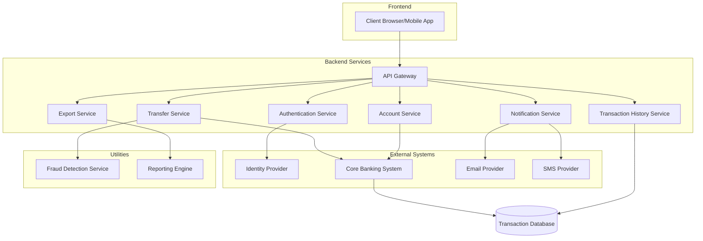

# Change Impact Analysis - Second Run

## SECTION 1: ORIGINAL CR/BRD/USER STORIES

The primary source of requirements is the `OBUserStories.txt` file containing 5 user stories for an online banking application:

1. **User Story 1: Account Login & Authentication** - Secure login functionality with two-factor authentication and session management
2. **User Story 2: View Account Balance** - Real-time balance viewing for multiple linked accounts
3. **User Story 3: Fund Transfer Between Accounts** - Transfer functionality between accounts with confirmation and receipt generation
4. **User Story 4: Transaction History** - View, filter and export transaction history 
5. **User Story 5: Alerts & Notifications** - Customizable alerts for important account activities

Note: No explicit artifact exists for "EmpTestCSharp_main". This appears to be a reference to a C# repository that is not available in the current project structure.

## SECTION 2: SECOND RUN IMPACT ANALYSIS TABLE (Unified Impact Analysis Table)

| Codebase/Repo | File/Component | Impact Type (add/modify/delete) | Direct/Indirect | Requirement/Reason | Relationship | Rationale for Inclusion | Affected Sections | Potential Risks | Change Required (Yes/No) | Annotation | Coverage Status (Complete/Missing) | Coverage Notes |
|---------------|----------------|--------------------------------|-----------------|-------------------|--------------|-------------------------|-------------------|----------------|--------------------------|------------|-----------------------------------|----------------|
| Online Banking | Authentication Service | modify | Direct | User Story 1 | Implements | Core login functionality | Login API, 2FA modules | Security vulnerabilities if implemented incorrectly | Yes | High priority | Complete | Needs comprehensive security testing |
| Online Banking | User Interface - Login | modify | Direct | User Story 1 | Implements | User-facing login components | Login form, 2FA validation | Poor UX if error handling is unclear | Yes | Medium priority | Complete | Ensure accessibility compliance |
| Online Banking | Session Management | modify | Direct | User Story 1 | Implements | Controls timeout functionality | Session tracking | Security risk if timeout not enforced | Yes | Medium priority | Complete | Test edge cases for session expiration |
| Online Banking | Account Service | modify | Direct | User Story 2 | Implements | Balance retrieval logic | Data access layer | Data accuracy issues | Yes | Medium priority | Complete | Verify real-time data refresh |
| Online Banking | User Interface - Dashboard | modify | Direct | User Story 2 | Implements | Display of account information | Balance widgets | Inconsistent UI if multiple accounts | Yes | Medium priority | Complete | Test with various account configurations |
| Online Banking | Transaction Service | modify | Direct | User Story 3 | Implements | Fund transfer logic | Transfer API, validation | Financial loss if validation fails | Yes | High priority | Complete | Comprehensive transaction testing required |
| Online Banking | User Interface - Transfers | add | Direct | User Story 3 | Implements | Transfer UI components | Form controls, confirmation | UX issues if flow is unclear | Yes | Medium priority | Complete | User testing recommended |
| Online Banking | Database Schema | modify | Indirect | User Stories 2,3,4 | Supports | Data storage for transactions | Tables, stored procedures | Data integrity issues | Yes | High priority | Complete | Migration plan needed |
| Online Banking | Transaction History Service | add | Direct | User Story 4 | Implements | History retrieval and filtering | Query logic, data access | Performance issues with large datasets | Yes | Medium priority | Complete | Pagination and caching recommended |
| Online Banking | User Interface - History | add | Direct | User Story 4 | Implements | Display of transaction history | List views, filters | Poor performance with many transactions | Yes | Medium priority | Complete | Test with large datasets |
| Online Banking | Export Service | add | Direct | User Story 4 | Implements | Export functionality | PDF/Excel generation | File format compatibility issues | Yes | Low priority | Complete | Verify across different platforms |
| Online Banking | Notification Service | add | Direct | User Story 5 | Implements | Alert generation and delivery | Event processing | Missed notifications | Yes | Medium priority | Missing | Need to define notification channels |
| Online Banking | User Interface - Settings | add | Direct | User Story 5 | Implements | Notification preferences | Configuration screens | Complex UX | Yes | Low priority | Missing | Need to define customization options |
| Online Banking | Security Module | modify | Indirect | User Stories 1,5 | Supports | Security monitoring | Breach detection | False positives/negatives | Yes | High priority | Complete | Security audit required |
| Online Banking | API Gateway | modify | Indirect | All User Stories | Connects | Route API calls | Request routing | Service discovery issues | Yes | Medium priority | Complete | Load testing recommended |

## SECTION 3: VALUE STREAM MAPPING TABLE and ARCHITECTURE DIAGRAM

### Value Stream Mapping Table

| Process Step | Input | Output | Lead Time | Processing Time | Value Added (Y/N) | Dependencies | Bottlenecks | Optimization Opportunities |
|--------------|-------|--------|-----------|-----------------|-------------------|--------------|-------------|----------------------------|
| Authentication | User credentials | Session token | 2s | 1s | Y | External identity provider | Peak load times | Caching of validation rules |
| Account Balance Retrieval | Account ID | Balance data | 1s | 0.5s | Y | Core banking system | Core banking API latency | Data caching strategy |
| Fund Transfer Initiation | Transfer details | Transfer request | 1s | 0.5s | Y | Account validation services | None identified | Pre-validate eligible accounts |
| Fund Transfer Processing | Transfer request | Transfer result | 3s | 2s | Y | Payment gateway, Fraud detection | Fraud check delays | Parallel processing where possible |
| Transaction History Query | Filter parameters | Transaction list | 3s | 2s | Y | Database performance | Large datasets | Query optimization, indexing |
| Export Generation | Transaction data | PDF/Excel file | 5s | 4s | Y | Reporting engine | Large exports | Background processing for large exports |
| Notification Triggering | Event data | Notification message | 1s | 0.5s | Y | Event detection | None identified | Event batching for similar notifications |
| Notification Delivery | Notification message | Delivered alert | 2s | 1s | N | External SMS/Email providers | Provider latency | Retry strategy, multiple providers |

### Architecture Diagram

